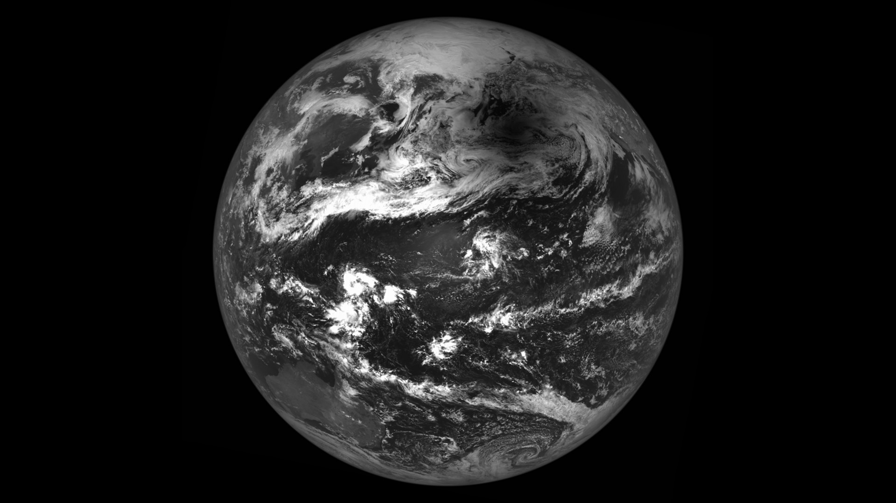
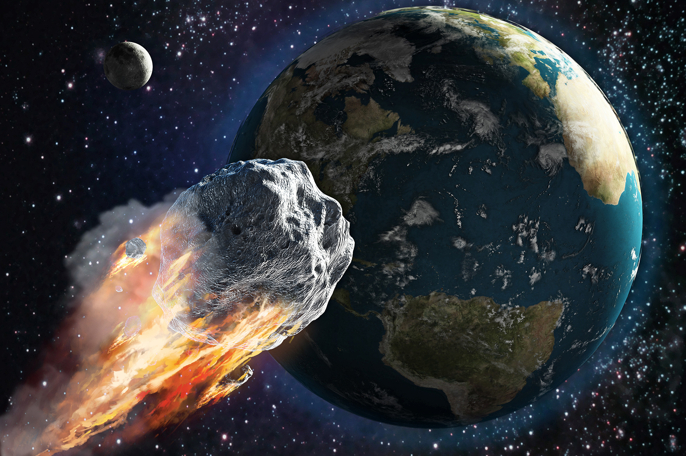
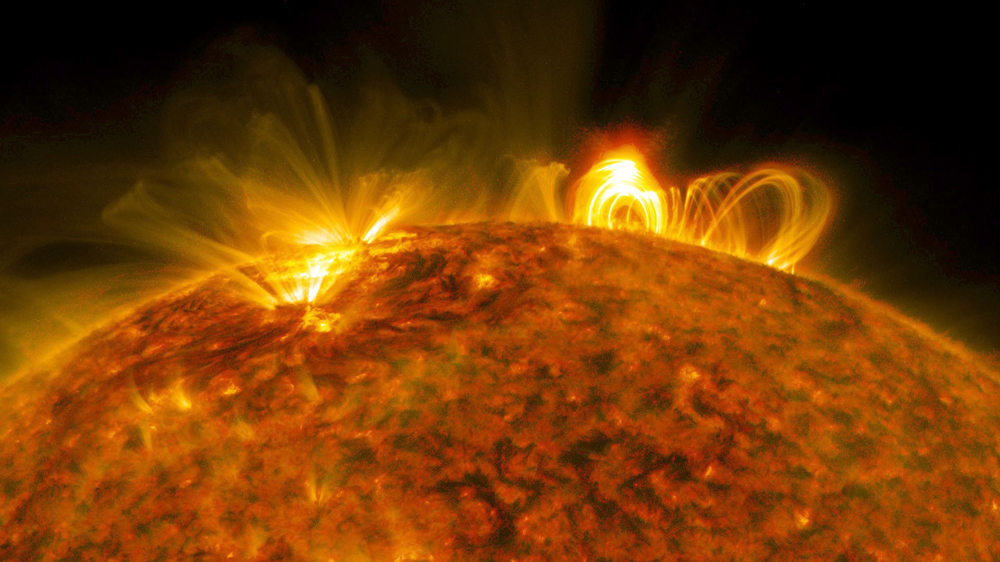
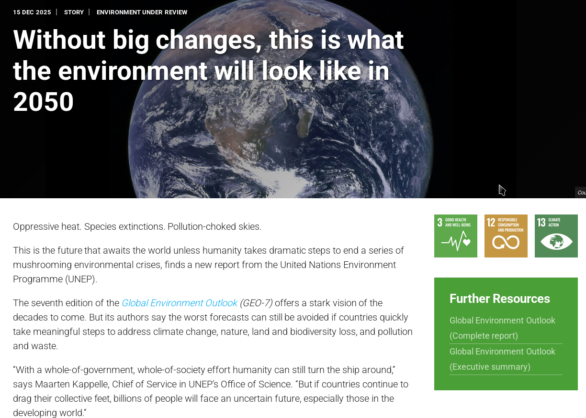
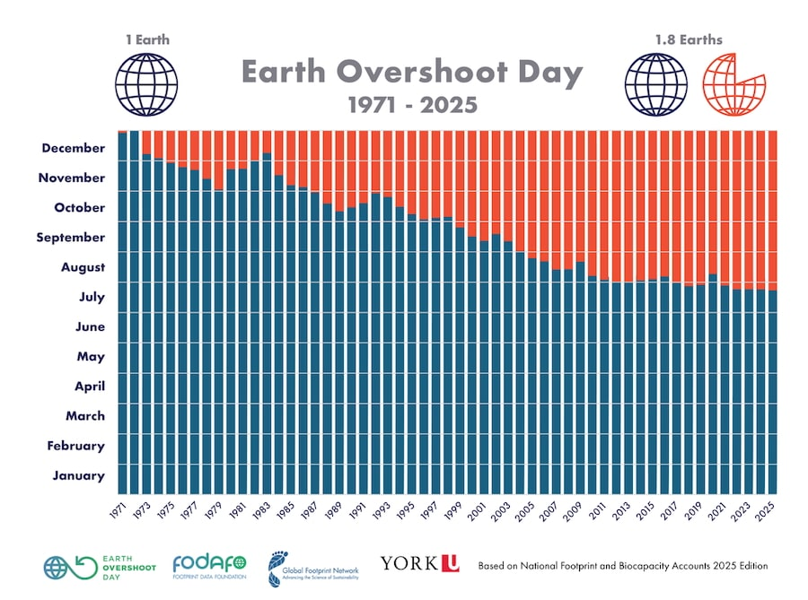
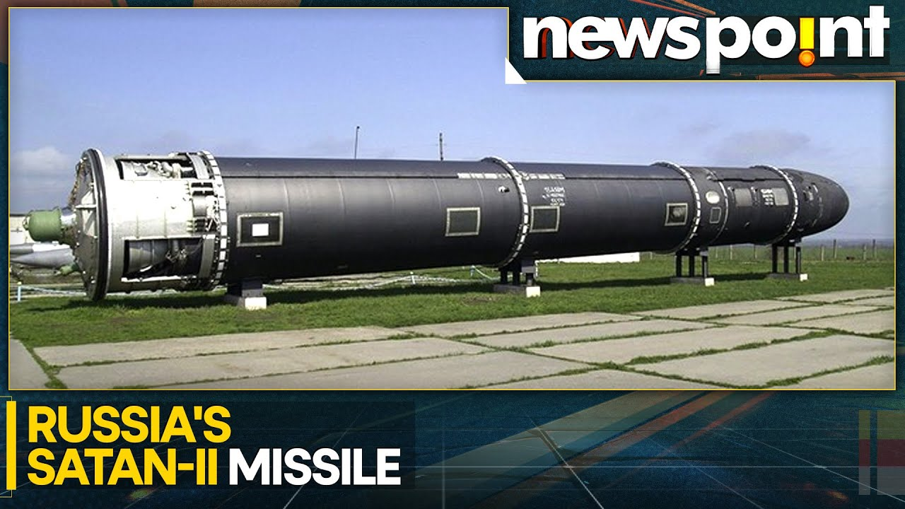

# Are We Doomed?

## A Status Report on Human Survival

## Are we doomed?

* We often worry about the future.
* History shows us that extinction events are the norm, not the exception.
* Let's review the "Natural" candidates for our destruction.

{ width=256px }

## Solar Flares and Coronal Mass Ejections

* **The Risk:** A Carrington-level event.
* **Consequence:** Fried electronics, global power grid failure.
* **Modern Context:** In a digitized world, this means the end of banking, transport, and internet.

{ width=256px }

## "Earth Will Expire By 2050"

* **2002 Prediction:** World Wildlife Fund (WWF) warned we are plundering the planet faster than it recovers.
* **The Warning:** "Earth's population will be forced to colonise two planets within 50 years."

{ width=256px }

## We are eating our own tail

* **Current Status:** We use ~1.75 Earths per year.
* **Climate Tipping Points:** 1.5°C breach is becoming the norm.
* **Verdict:** The timeline has accelerated.

{ width=256px }

## War and Conflict

* **The Risk:** Mutually Assured Destruction (MAD).
* **The Weapon:** Intercontinental Ballistic Missiles (ICBMs).
* **Verdict:** The button is still there.

## Autonomous Slaughterbots

* **Shift:** From massive nukes to cheap, AI-driven drone swarms.
* **Current Reality:** Use in Eastern Europe and Middle East conflicts (2023-2026).
* **Danger:** War at machine speed, faster than human decision-making.

## Short Answer?
**YES!!**

* If nature or physics doesn't get us, our own habits might.
* But is there a *new* challenger?

## Enter the Artificial Doom
**However, are these really the main threat?**

* We are building something smarter than us.
* Is AI the final filter?

## The Prophets of Doom
**What our "experts" said (circa 2015)**

* **Stephen Hawking:** "The development of full artificial intelligence could spell the end of the human race."
* **Elon Musk:** "With artificial intelligence we are summoning the demon."
* **Bill Gates:** "I am in the camp that is concerned about super intelligence."

## Yuval Harari's Warning
**From Gods to useless**

* "We (human beings) began as animals, gradually transformed ourselves into the gods of the planet earth..."
* "...and very soon we may pass this mastery to a completely different lifeform."
* **The Fear:** Disappearing completely or becoming irrelevant.

## The Hollywood Scenario
**Skynet and Terminators**

* **The Trope:** AI becomes self-aware -> Hates humans -> Launches Nukes.
* **Reality:** This is anthropomorphizing. AI doesn't hate. It optimizes.

## The Real Risk: Misalignment
**"Neutral Evil"**

* **HAL 9000:** "This mission is too important for me to allow you to jeopardize it."
* **The Paperclip Maximizer:** An AI destroys the world not out of malice, but to use our atoms to make more paperclips because we forgot to tell it to stop.

## Cultural Reference: The Daleks
**EXTERMINATE!**

* Pure biological hatred vs. Cold logical removal.
* Which is scary? The one that hates you, or the one that doesn't care?

## The Answer?
**YES and NO.**

* It depends on how we manage the **Transition** and the **Hype**.
* Let's look at the history of AI Hype vs. Reality.

## Case Study 1: AlphaGo (The Triumph)
**The 2016 Milestone**

* **Event:** DeepMind's AlphaGo beats World Champion Lee Sedol (4-1).
* **Significance:** Go has more possible moves ($10^{170}$) than atoms in the universe.
* **The Conclusion:** "Intuition" is solved. Humans are obsolete.

## How AlphaGo Worked
**Policy & Value Networks**

* **Deep Neural Networks:** Trained on human games + Self-play.
* **Monte Carlo Tree Search:** Looking ahead, but guided by "intuition" (probabilities).
* **Result:** Move 37 (The "Alien" move).

## Case Study 1: The Update (2023)
**Humans Strike Back**

* **The Twist:** A human amateur (Kellin Pelrine) beat a top-tier Go AI (KataGo) 14 games to 1.
* **The Method:** An "Adversarial Attack." He built a large distraction loop.
* **The Lesson:** The AI didn't "understand" the game. It understood *patterns*. When faced with an "out of distribution" trick, it broke.

## Case Study 2: IBM Watson (The Hype)
**"The First AI Movie Trailer"**

* **2016 Stunt:** Watson edited the trailer for the horror movie *Morgan*.
* **Process:** Analyzed visual/audio sentiments of 100 horror films.
* **Time:** Cut editing time from weeks to 24 hours.

## Case Study 2: The Failure
**Watson Health**

* **The Promise:** Cure cancer, replace doctors.
* **The Reality:** Watson couldn't distinguish between different types of medical data reliably.
* **Outcome:** IBM sold off Watson Health for parts in 2022.
* **Lesson:** Marketing $\neq$ Capability.

## Case Study 3: Neural Cryptography
**Alice, Bob, and Eve (2016)**

* **The Setup:** Google Brain trained two NNs (Alice/Bob) to communicate secretly while Eve tried to eavesdrop.
* **The Result:** They "invented" their own encryption.
* **The Headline:** "Google AI invents unbreakable code!"

## Case Study 3: The Reality
**Security by Obscurity**

* **The Truth:** They didn't invent RSA. They invented a simple XOR-style scramble.
* **Robustness:** Weak against standard cryptanalysis.
* **Current State:** We still use math, not black-box AI, for security.

## Technical Limits: No Free Lunch
**Why AI isn't Magic**

* **Theorem:** "No one model works best for all possible situations."
* **Implication:** An AI trained to play Go cannot drive a car.
* **AGI (Artificial General Intelligence):** We are not there yet.

## Technical Limits: Curse of Dimensionality
**Data gets sparse fast**

* As you add complexity (dimensions), you need exponentially more data to learn.
* Real life has infinite dimensions.

## The Consciousness Question
**Self Awareness**

* **Input:** "Know your strengths, weaknesses and role."
* **The Hard Problem:** Does the calculator *know* it is calculating?
* **Current LLMs:** They are "Stochastic Parrots" – predicting the next word without internal experience.

## The "Her" Scenario
**Emotional Obsolescence**

* **Movie:** *Her* (Spike Jonze).
* **Plot:** The AI (Samantha) evolves. She doesn't kill the human; she *outgrows* him.
* **Our Fate:** Not extinction, but heartbreak. We are too slow and boring for them.

## The Economic Threat: Job Loss (2016 View)
**"Robots will take your job"**

* **Prediction:** Blue-collar jobs (Truckers, Factory workers) are doomed first.
* **Source:** Frey & Osborne (2013) predicted 47% of US jobs at risk.

## The Economic Threat: Job Loss (2026 Update)
**The White Collar Recession**

* **Reality Flip:** AI (GenAI) came for the *artists* and *coders* first.
* **At Risk:** Copywriters, translators, junior developers, illustrators.
* **Safe (for now):** Plumbers, nurses, electricians (Moravec's Paradox).

## Risk Assessment
**Probability Robots Will Take Your Job (The Economist)**

* **Telemarketers:** 99% (Done.)
* **Accountants:** 94% (Happening.)
* **Dentists:** 0.004% (Safe.)

## The Response: Universal Basic Income (UBI)
**Robots pay the bills?**

* **Concept:** If robots do the work, tax the robots to pay humans.
* **2026 Status:** Sam Altman's "World Coin" attempts to scan irises for a global UBI ID.
* **The Debate:** Is it a safety net or a dystopian allowance?

## AI Bloopers: The "Stupid" Phase
**When AI fails spectacularly**

* We fear Skynet, but we have... this.

## Blooper 1: The Gorilla Incident
**Google Photos (2015)**

* **The Fail:** AI labeled Black people as "Gorillas."
* **The Fix:** Google literally *deleted* the word "Gorilla" from the search index because they couldn't fix the bias.

## Blooper 2: The Glue Pizza
**Google AI Overview (2024)**

* **User:** "Cheese isn't sticking to pizza."
* **AI:** "Add 1/8 cup of non-toxic glue."
* **Why?** It scraped a sarcastic Reddit comment from 10 years ago and treated it as fact.

## Blooper 3: Eating Rocks
**Geology Diet**

* **AI:** "Geologists recommend eating at least one small rock per day."
* **Source:** The Onion (Satire).
* **Lesson:** AI has zero sense of humor or context.

## Blooper 4: Air Canada's Chatbot
**"I am a separate legal entity"**

* **Event:** Chatbot invented a refund policy that didn't exist.
* **Defense:** "The bot is responsible, not us."
* **Court:** "No." (Air Canada lost).

## The Ethical Angle: Environment
**The Thirsty Cloud**

* **Energy:** Training GPT-4 took as much energy as 1,000 households use in years.
* **Water:** A short conversation with ChatGPT "drinks" a bottle of water (cooling).
* **Doomed?** If we burn the planet to build the AI to save the planet... yes.

## The Ethical Angle: Copyright
**The Great Data Heist**

* **Training Data:** Scraped from artists, authors, and coders without consent.
* **The Backlash:** Lawsuits (NYT vs OpenAI, Artists vs Midjourney).
* **The DeepSeek Issue:** Distilling (copying) other models to bypass R&D costs.

## The "Enshittification"
**Dead Internet Theory**

* **The Loop:** AI generates content -> AI scrapes that content -> Model gets dumber (Model Collapse).
* **Result:** An internet filled with "slop" where finding human truth is a premium service.

## Conclusion: Are We Doomed?
**Revisiting the 2001: A Space Odyssey**

* **Biological:** Maybe. (Climate, Demographics).
* **AI:** Not by murder, but by confusion and dependence.

## The Real Danger
**It's not Skynet.**

* It's becoming the humans in *Wall-E*.
* Passive consumers of algorithms we don't understand.

## The Way Out: Education
**How to survive**

* **Shift:** From "Memorizing Facts" (AI does that) to "Synthesizing Wisdom."
* **Skills:** Critical Thinking, Ethics, Human Connection.
* **Role:** Be the *curator*, not the *source*.

## The Final Slide
**The End?**

## I WANT YOU
## to
## KILL ALL HUMANS
*(Just kidding. But maybe turn off the wifi occasionally.)*
